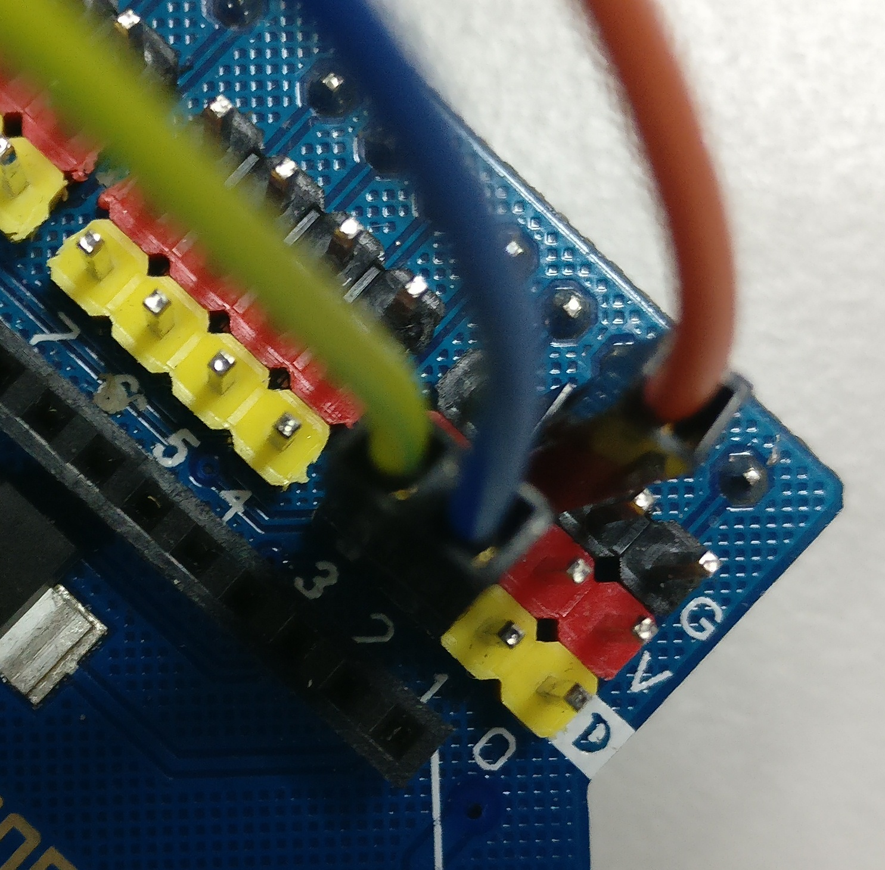
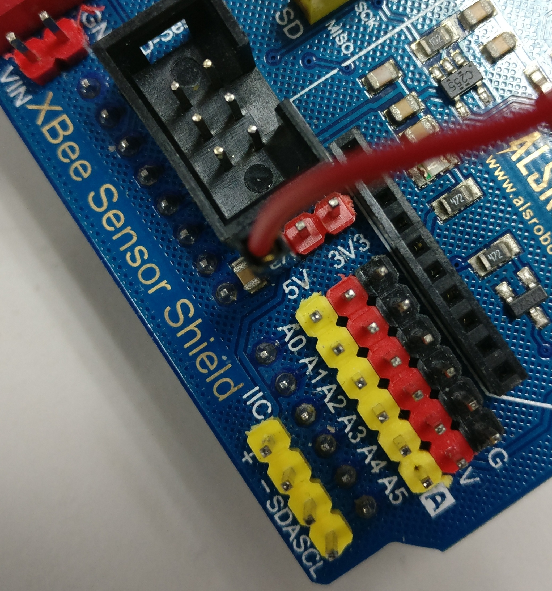
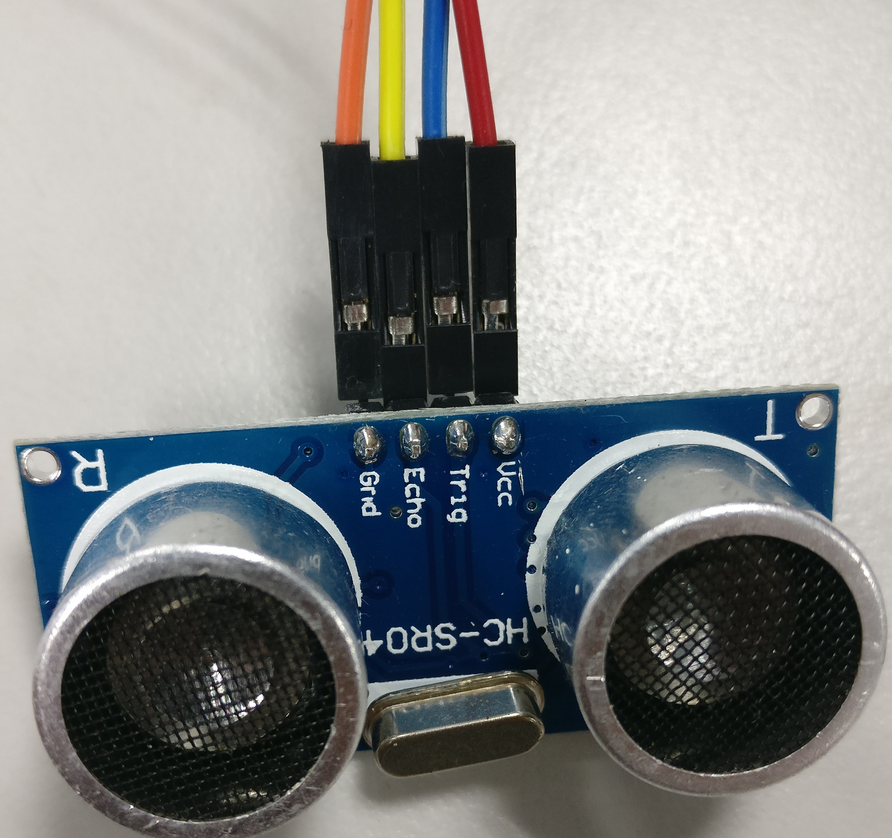
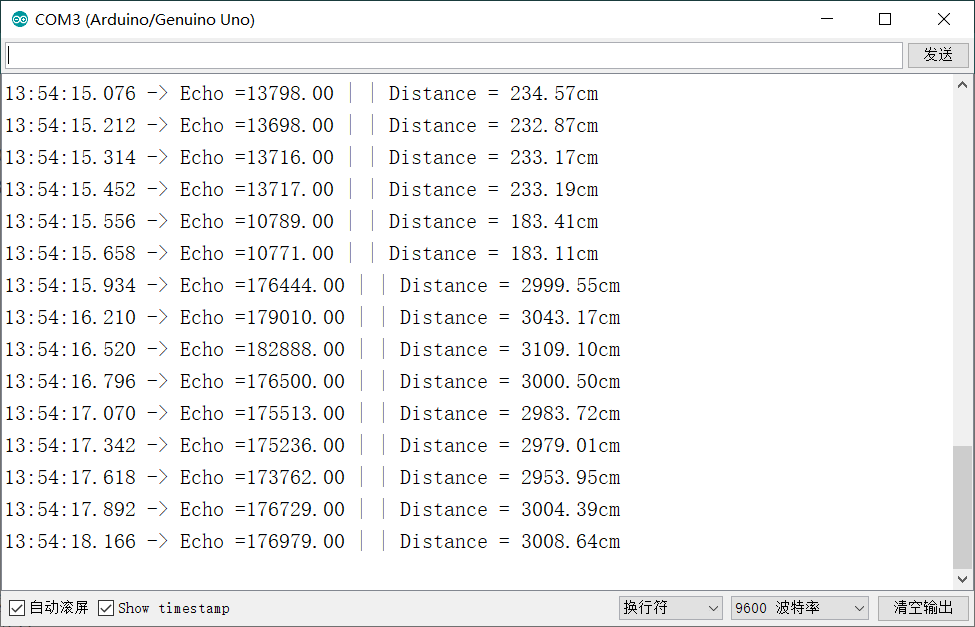

# HC-SR04超声波传感器

使用杜邦线（母母）连接XBee扩展版和Arduino，实现超声波测距。

代码出处：[Arduino 和 HC-SR04 超声波传感器 测距](https://blog.csdn.net/ling3ye/article/details/51407328)

### 接法

Grid -> G

Echo -> D3

Trig -> D2

Vcc  -> 5V

Grid-Echo-Trig

Vcc 因为我的扩展版V都是坏掉的，所以接到了这里。

HC-SR04

串口输出
