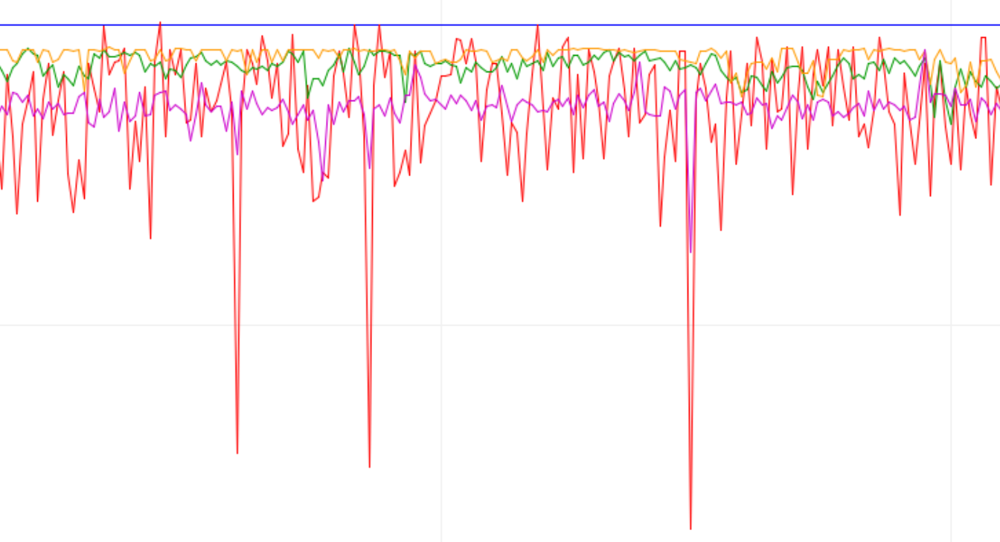

# 滤波器的使用

分别在10cm， 30cm， 100cm进⾏数据采集，将采集的数据⽤三种不同滤波器进⾏处理，将原始数据，处理后的数据，真实的数值⽤⼆维图展示。
    

### 构想

使用三种不同的滤波器：中值平均滤波器、中位值滤波器、算数均值滤波器。

第一个滤波器是后两者的结合。

### 接法

#### HC-SR04超声波传感器：

Grid -> G

Echo -> D5

Trig -> D4

Vcc  -> 5V

### 结果图

图表的标识从左到右依次为：

真实数据，原始数据，中值平均滤波值，中位值滤波值，算数均值滤波值。

- **水平蓝线**为真实数据，是我们设定的10cm、30ccm、100cm值；
- **红色折线**为传感器测量的原始数据；
- **绿色折线**为中值平均滤波值；
- **橙色折线**为中位值滤波值；
- **紫色折线**为算数均值滤波值。

#### 10cm测距

从图中可以看出我们的传感器放置位置**略微小于10cm**，四种变化数据都在10cm处波动，此时**无干扰**。

#### 30cm测距

从图中可以看出我们的传感器放置位置**接近30cm**，四种变化数据都在30cm处波动，此时**无干扰**。

#### 100cm测距

从图中可以看出我们的传感器放置位置**明显小于100cm**，四种变化数据大约在98cm处波动，此时**有5次人为干扰**，红色折线（原始数据）向下大幅度波动了5次。

放大波动细节，可以看到：**紫色折线（算数均值滤波）**在波动时，也随着波动，但是幅度偏小；**绿色折线（中值平均滤波）**和**橙色折线（中位值滤波）**波动不明显，说明两者能有效克服因偶然因素引起的波动干扰，体现了中位值滤波的优点。

